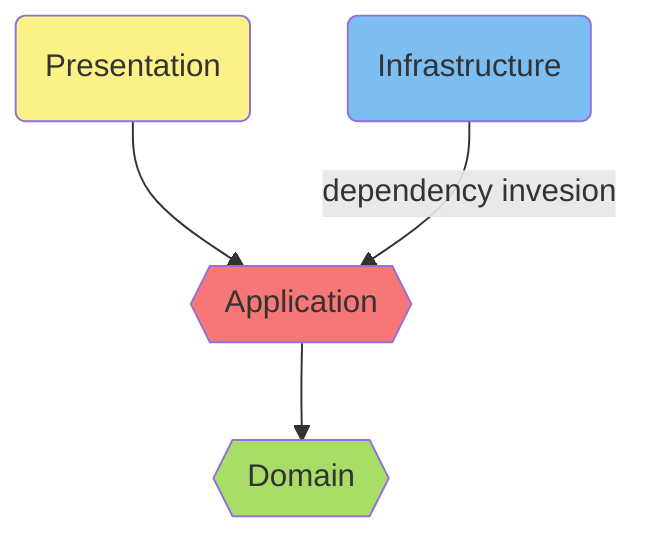

# Clean Architecture Workshop

This is a working example that implemented using the [Clean architecture](https://blog.cleancoder.com/uncle-bob/2012/08/13/the-clean-architecture.html) to solve the Cinema System problem. We can learn this at the end of the workshop to get the idea of how to structure and implement logic in Clean style.

## Clean Architecture

Clean Architecture is a set of guidelines for structuring software applications. It emphasizes building software that's independent of frameworks, databases, UI, or any other external factors. This makes the code more maintainable, testable, and adaptable to future changes.

## Implementation in this Cinema System workshop

### Architecture

