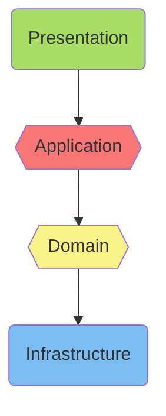

# Clean Architecture Workshop

This branch is a working example that implemented using the [N-Tier architecture](https://stackify.com/n-tier-architecture/) to solve the problem. We can learn from this example the disadvantages of dependency on external party.

## N-Tier Architecture

N-tier architecture is also called multi-tier architecture because the software is engineered to have the processing, data management, and presentation functions physically and logically separated.

## Implementation in this Cinema System workshop

### Architecture

### Advantages & Disadvantages

Architeturing dependencies in this way is align with how data and control flow be (user input -> core logic -> save data or process payment). However, if there is any change in 3rd party or infrastructure framework it will impact core logic. It may not be a big deal if the change is managable, but it would require huge effort if you completed change 3rd party or frameworks.

This dependency concern is the problem that [Clean Architecture](https://blog.cleancoder.com/uncle-bob/2012/08/13/the-clean-architecture.html) try to solve.

You may see a working example which implemented following the Clean Architecture in the `clean_architecture` branch.
