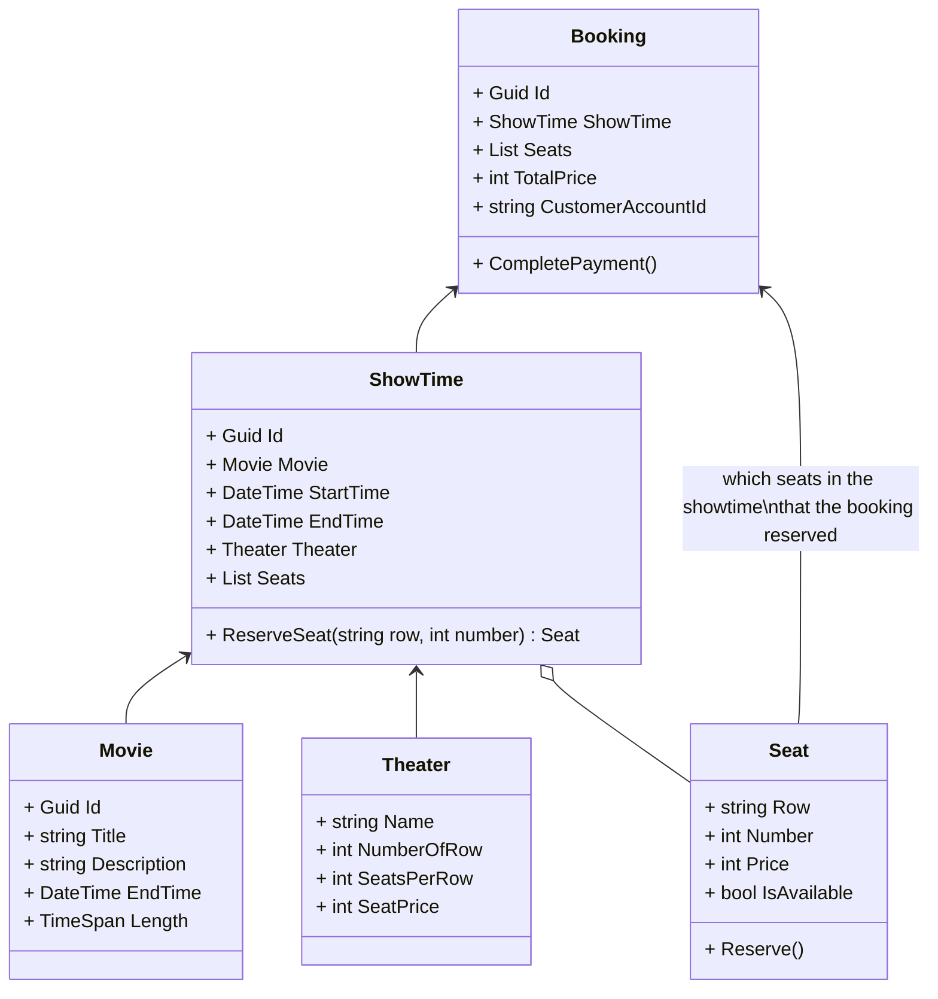

# Clean Architecture Workshop

This repository is created to be a workshop codebase to learn the [Clean Architecture](https://blog.cleancoder.com/uncle-bob/2012/08/13/the-clean-architecture.html).

## Workshop Scenario

In this workshop we will implement a Cinema System to support _ticket purchasing_ use case.

### Cinema System

This may be an example user interface of a cinema system when a user try to search for a movie and book a show time.

#### User stories for ticket purchasing use case

As a customer,​

- I want to see now-showing movies.​
- I want to search movies by title.​
- I want to see details of a movie, then view its showtimes, available seats, and pricing, so that I can select preferable showtime and seats.​
- I want to purchase ticket by paying with my default payment method and get booking detail for reference.​

_NOTE:_

- Now-showing mean having showtimes between now to the next 15 days.- Let assume that the customer has an account and logged in.​
- Customer have setup default payment method.​

## Code base

In this repository, we already provided some key entities and classes to save time crafting them.

### Class diagrams of some key entities

Currently the codebase is incompleted. Most of classes be put in a temporary folder `CleanCodeApp.Domain/ToBeStructured` and most of them have only properties defined but methods. Meaning there is no logic to solve the user stories yet.

## TODO

In the workshop you have to

1. Structure classes in proper layer/folder.​
   - Moving classes around may cause issue of missing reference. You can run command to add project reference to allow referencing class from other domain. For example,
     `dotnet add tests/CleanCodeApp.Application reference source/CleanCodeApp.Domain`
2. Implement logic to _GetNowShowingMovies_, _GetShowTimesByMovieIdAndDate_ and _CreateBooking​_. You have to consider where to put the logic. You may put it in existing class or create a new class for it.
   

## Other Branches

There are 3 branches in this repository, which are

- **main** (this branch) : the workshop workspace. It consist of incompleted code in an improper layers that require architecturing and implementing to acheive the system requirement.
- **n-tier_architecture** : a working example that implemented using the [N-Tier architecture](https://stackify.com/n-tier-architecture/) to solve the problem. We can learn the disadvantages of dependencies on external parties from this branch.
- **clean_architecture** : a working example that implemented using the [Clean architecture](https://blog.cleancoder.com/uncle-bob/2012/08/13/the-clean-architecture.html) to solve the problem. We can learn this at the end of the workshop to get the idea of how to structure and implement logic in Clean style.
