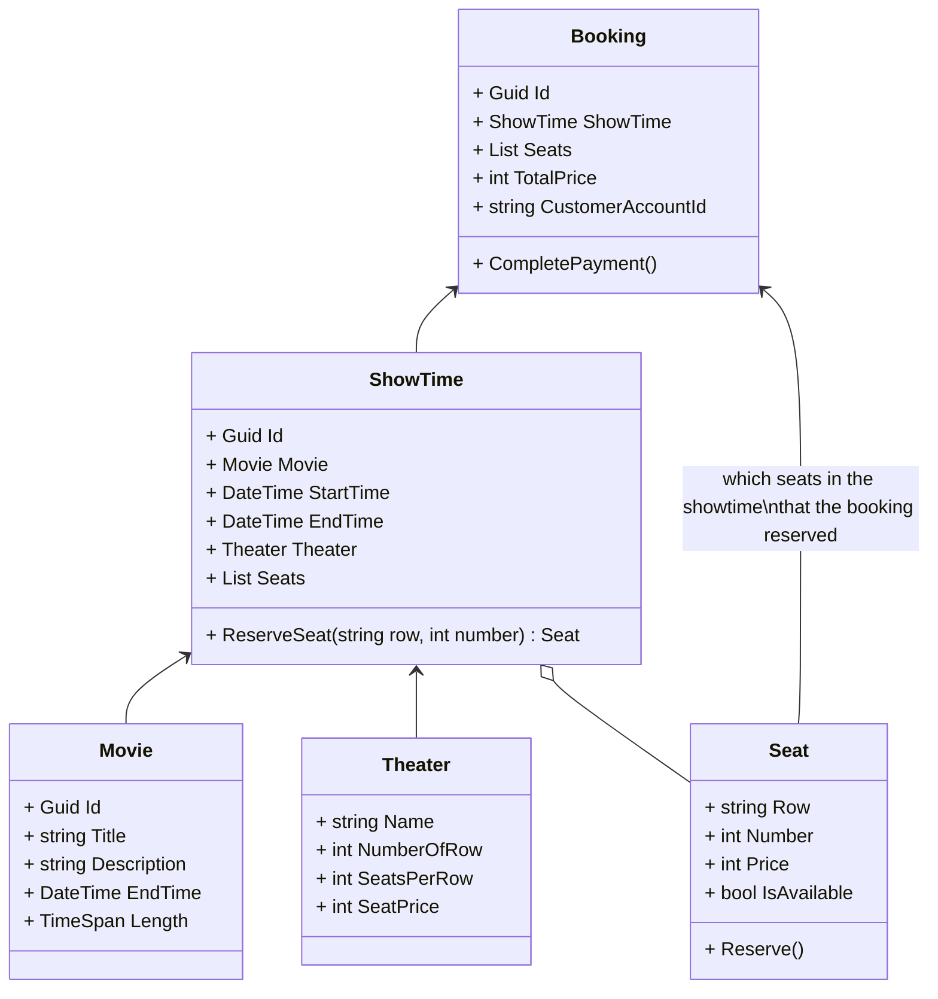
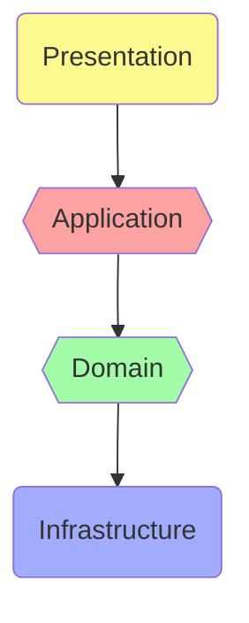
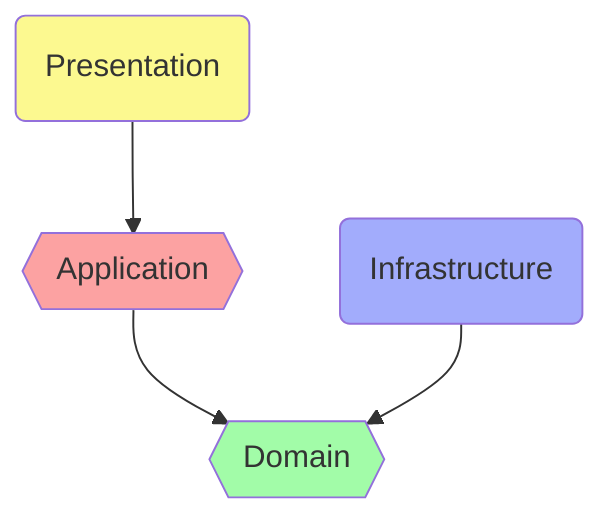

# Clean Architecture Workshop

This repository is created to be a workshop codebase to learn the [Clean Architecture](https://blog.cleancoder.com/uncle-bob/2012/08/13/the-clean-architecture.html).

There are 3 branches in this repository, which are

- **main** : the workshop workspace. It consist of incompleted code in an improper layers that require architecturing and implementing to acheive the system requirement.
- **n-tier_architecture** : a working example that implemented using the [N-Tier architecture](https://stackify.com/n-tier-architecture/) to solve the problem. We can learn from this example the disadvantages of dependency on external party.
- **clean_architecture** : a working example that implemented using the [Clean architecture](https://blog.cleancoder.com/uncle-bob/2012/08/13/the-clean-architecture.html) to solve the problem. We can learn this at the end of the workshop to get the idea of how to structure and implement logic in Clean style.

## Workshop Scenario

In this workshop we will implement a Cinema System to support _ticket purchasing_ use case.

### Cinema System

This may be an example user interface of a cinema system when a user try to search for a movie and book a show time.

#### User stories for ticket purchasing use case

As a customer,​

- I want to see now-showing movies.​
- I want to search movies by title.​
- I want to see details of a movie, then view its showtimes, available seats, and pricing, so that I can select preferable showtime and seats.​
- I want to purchase ticket by paying with my default payment method and get booking detail for reference.​

_NOTE:_

- Now-showing mean having showtimes between now to the next 15 days.- Let assume that the customer has an account and logged in.​
- Customer have setup default payment method.​

## Code base

In this repository, we already provides some key entities and classes to save time crafting them.

### Class diagrams of some key entities

Branch name [solution-break-depency](https://github.com/rachanee-tw/dotrez-training-clean/tree/solution-break-dependency)

### N-Tier Architecture Dependency Graph

Branch name [solution](https://github.com/rachanee-tw/dotrez-training-clean/tree/solution)

### Clean Architecture Dependency Graph

